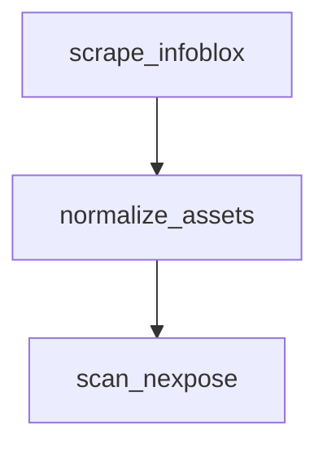

# Always use MermaidJS for diagrams

Never use ASCII art diagrams. All diagrams must be written in MermaidJS.

**Correct:**


**Wrong:**
```
scrape_infoblox --> normalize_assets --> scan_nexpose
```

## Diagram types

- `flowchart TD` (top-down) or `flowchart LR` (left-right) — data flows and process diagrams
- `sequenceDiagram` — API interactions and request/response flows
- `erDiagram` — data models and schema relationships
- `gantt` — timelines and project milestones

## Conventions

- Use `<br />` for line breaks inside node labels, NOT `\n`
